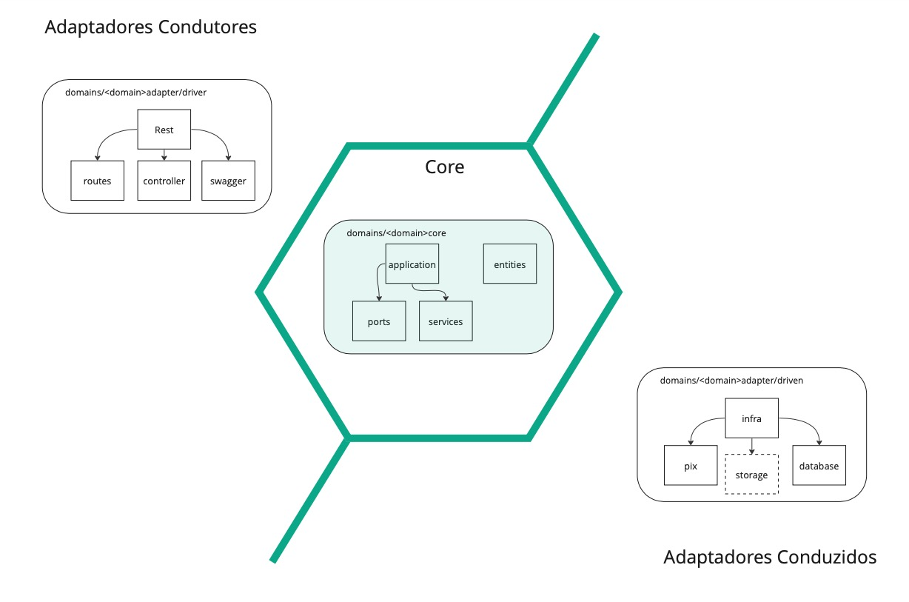
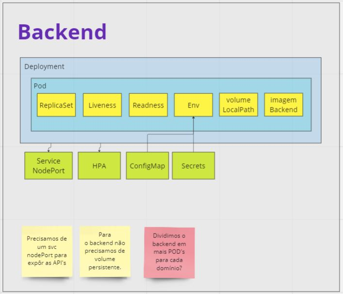
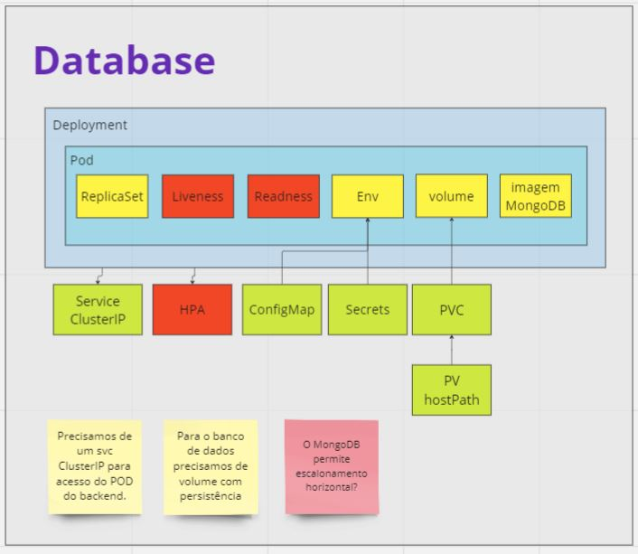
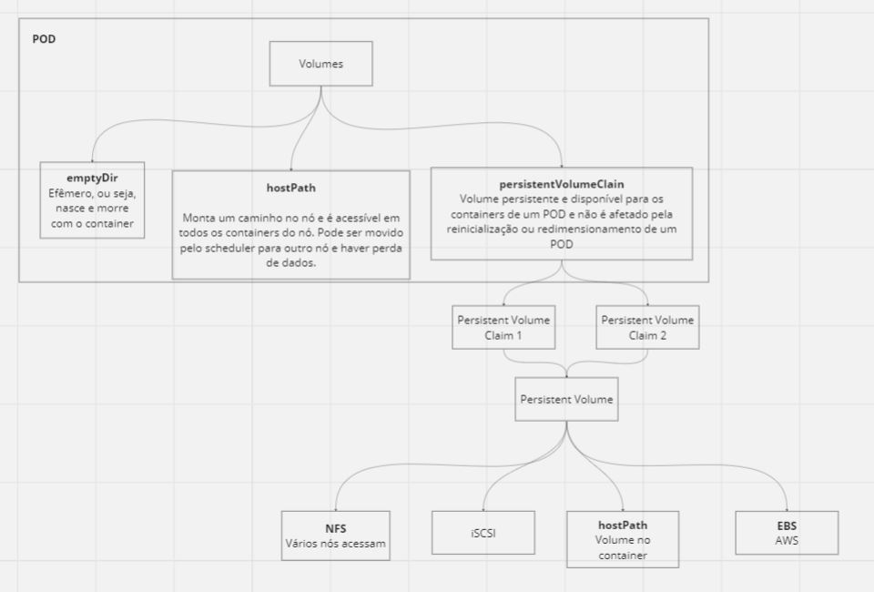

# FIAP Tech Challenge 5SOAT

Grupo 22
## Stack utilizada

**Front-end:** N/A

**Back-end:** Node 20, Express 4.18.2, Typescript 5.3.3

**Banco:** MongoDB

## Requisitos de negócio

**Sistema de Autoatendimento de Pedidos - Lanchonetes**

**Clientes**

Incluir, Alterar e Consultar os Clientes:

Identificação por CPF;

A inclusão deverá ter CPF, nome e e-mail.

**Produtos**

Incluir, Alterar, Excluir e Listar todos ou por categorias os Produtos.

**Pedidos**

Incluir, Alterar, Listar os Pedidos:

O combo poderá ter ou não os seguintes itens: lanche, acompanhamento e bebida. 
Deve ser exibido o nome, descrição e preço de cada produto;

O pedido deverá ter os seguintes status: Recebido, em Preparação, Pronto e Finalizado.

Deverá aparecer em um monitor para o cliente acompanhar;

A lista de pedidos deverá retorná-los com suas descrições e ordenados com a seguinte regra:

   Pronto, Em Preparação e Recebido;
   
   Pedidos mais antigos primeiro e mais novos depois
   
   Pedidos finalizados não devem aparecer na lista.
  
Quando o pedido estiver pronto, o sistema deverá notificar o cliente para retirada. Ao ser    retirado, o pedido deve ser atualizado para status finalizado.

**Fazer Checkout do Pedido:**

Deverá receber os produtos solicitados e retornar à identificação do pedido;

**Pagamento:**

A forma de pagamento será via QRCode do Mercado Pago;

Webhook para receber confirmação de pagamento aprovado ou recusado;

Consultar o status do pagamento pedido (aprovado ou não);

Após o pedido confirmado e pago, ele é enviado para cozinha.

## Requisitos de infraestrutura
**Criar uma arquitetura em Kubernetes que atenda aos requisitos**

Escalabilidade com aumento e diminuição de Pods conforme demanda;

Arquivos manifestos (yaml) precisam estar no Github junto com a nova verão do código.


## Preparação para desenvolver localmente

Clone o projeto

```bash
  git clone https://github.com/dcleme17/fiap-tech-challenge-grupo22.git
```

Vá para o diretório do projeto

```bash
  cd fiap-tech-challenge-grupo22/backend
```

Instale o pnpm (pelo menos 3 vezes mais rápido que o npm)

```bash
  npm install pnpm -g
```

Instale as dependencias

```bash
  pnpm install
```

Inicie o servidor

```bash
  pnpm dev
```

Visão geral da estrutura do projeto



Estrutura backend



Estrutura database



Estrutura POD



Estrutura dos arquivos e diretórios do projeto
```shell
src
   ├── application.ts
   ├── 📁 configuration
   │   ├── environment.config.ts
   │   ├── 📁 environments
   │   │   ├── development.env
   │   │   └── production.env
   │   ├── express.config.ts
   │   ├── routes.config.ts
   │   └── server.config.ts
   ├── 📁 domains
   │   ├── 📁 cliente
   │   │   ├── 📁 adapter
   │   │   │   ├── 📁 driven
   │   │   │   │   └── 📁 infra
   │   │   │   │       └── 📁 database
   │   │   │   │           └── cliente.database.ts
   │   │   │   └── 📁 driver
   │   │   │       └── 📁 rest
   │   │   │           ├── 📁 controllers
   │   │   │           │   └── cliente.controller.ts
   │   │   │           ├── 📁 routes
   │   │   │           │   └── cliente.route.ts
   │   │   │           └── 📁 swagger
   │   │   │               └── acesso.swagger.ts
   │   │   └── 📁 core
   │   │       ├── 📁 applications
   │   │       │   ├── 📁 ports
   │   │       │   │   └── cliente.port.ts
   │   │       │   └── 📁 services
   │   │       │       └── cliente.service.ts
   │   │       └── 📁 entities
   │   │           ├── cliente.ts
   │   │           └── cliente.versao.ts
   │   ├── 📁 pagamento
   │   │   ├── 📁 adapter
   │   │   │   ├── 📁 driven
   │   │   │   │   └── 📁 infra
   │   │   │   │       ├── 📁 database
   │   │   │   │       │   └── pagamento.database.ts
   │   │   │   │       └── 📁 pix
   │   │   │   └── 📁 driver
   │   │   │       └── 📁 rest
   │   │   │           ├── 📁 controllers
   │   │   │           │   └── pagamento.controller.ts
   │   │   │           ├── 📁 routes
   │   │   │           │   └── pagamento.route.ts
   │   │   │           └── 📁 swagger
   │   │   │               └── pagamento.swagger.ts
   │   │   └── 📁 core
   │   │       ├── 📁 applications
   │   │       │   ├── 📁 ports
   │   │       │   │   └── pagamento.port.ts
   │   │       │   └── 📁 services
   │   │       │       └── pagamento.service.ts
   │   │       └── 📁 entities
   │   │           ├── pagamento.ts
   │   │           └── pagamento.versao.ts
   │   ├── 📁 pedido
   │   │   ├── 📁 adapter
   │   │   │   ├── 📁 driven
   │   │   │   │   └── 📁 infra
   │   │   │   │       └── 📁 database
   │   │   │   │           ├── pedido.database.ts
   │   │   │   │           └── produto.database.ts
   │   │   │   └── 📁 driver
   │   │   │       └── 📁 rest
   │   │   │           ├── 📁 controllers
   │   │   │           │   ├── pedido.controller.ts
   │   │   │           │   └── produto.controller.ts
   │   │   │           ├── 📁 routes
   │   │   │           │   ├── pedido.route.ts
   │   │   │           │   └── produto.route.ts
   │   │   │           └── 📁 swagger
   │   │   │               ├── pedido.swagger.ts
   │   │   │               └── produto.swagger.ts
   │   │   └── 📁 core
   │   │       ├── 📁 applications
   │   │       │   ├── 📁 ports
   │   │       │   │   ├── pedido.port.ts
   │   │       │   │   └── produto.port.ts
   │   │       │   └── 📁 services
   │   │       │       ├── pedido.service.ts
   │   │       │       └── produto.service.ts
   │   │       └── 📁 entities
   │   │           ├── itempedido.ts
   │   │           ├── pedido.ts
   │   │           ├── pedido.versao.ts
   │   │           ├── produto.ts
   │   │           └── produto.versao.ts
   │   └── 📁 suporte
   │       ├── 📁 entities
   │       │   ├── custom.error.ts
   │       │   └── custom.response.ts
   │       └── 📁 infra
   │           ├── 📁 database
   │           │   └── mongodb.ts
   │           └── error.handler.ts
   ├── 📁 swagger
   │   ├── swagger.json
   │   └── swagger.ts
   └── swagger.ts
```

## Subindo os containers do Docker

Execute os comandos abaixo (o primeiro destrói todos os containers e volumes do docker, incluindo o banco de dados, então cuidado.)

```bash
  docker-compose down -v --rmi local
  docker-compose up -d
```

Após completar a incialização dos containers, os serviços podem ser acessados conforme abaixo:

Backend (API)
```bash
http://localhost:3000/api/<dominio>/<operações>
```
Documentação (Swagger Hub) será exposta na URL abaixo
```bash
https://app.swaggerhub.com/apis/YUMIALP/tech-challenge_fiap/1.0.0
```
Collections
```bash
https://meera-studio.postman.co/workspace/cdf5f9ab-59c8-420c-acb6-144f0b6195b1/request/1116492-7346a3a7-b607-42aa-86d6-dc6f08756c6d
```
MongoDB (pelo terminal do docker é possível usar o mongosh https://www.mongodb.com/docs/mongodb-shell/)
```bash
localhost:27017
```
Vídeo
```bash
https://www.youtube.com/watch?v=F19b3GPzJHo 
```